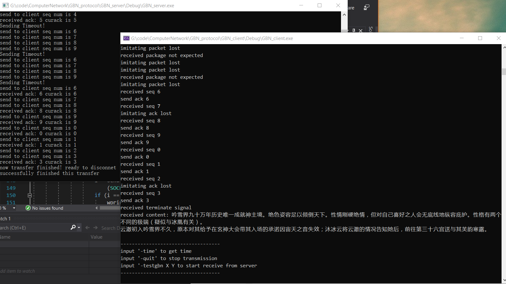

# 文档

## 背景

1. 在本实验中，接受数据使用`recvfrom`，而上一个代理服务器的实验使用了`recv`。二者的不同：

- `recv`既可以用在面向连接，也可以用在无连接。`recv`会仅接受对应地址的信息. 对应地址通过`bind`或者`accept`指定。`recv`的socket必须已经建立连接. 因此`recv`一般用在TCP连接中, 因为TCP连接建立后地址是固定的, 在`recv`的参数里也没有地址.
- `recvfrom`既可以用在已经建立的socket,也可以用在还没有连接的socket. `recvfrom`一般是用在无连接类型的socket中. 一般是对指定端口全部的地址进行接收. `recvfrom`一般用在UDP中, 可以方便地获得地址并进行回复. 微软关于[recvfrom](https://docs.microsoft.com/en-us/windows/win32/api/winsock/nf-winsock-recvfrom)的文档里给出了关于`recvfrom`的用例, 即从一个端口接受全部信息.

    `send`和`sendto`也具有类似区别. 

2. `ioctlsocket`用来设置socket的状态，有更强大的版本`WSAIoctl`。参考微软的[文档](https://docs.microsoft.com/en-us/windows/win32/api/winsock/nf-winsock-ioctlsocket)

3. 阻塞模式与非阻塞模式

   - 阻塞模式：等待对方的报文，例如`accept()`方法将会阻塞服务器线程直到一个呼叫到来.
   - 非阻塞模式：执行此套接字的网络调用时，不管是否执行成功，都立即返回。比如调用`recv()`函数读取网络缓冲区中数据，不管是否读到数据都立即返回，而不会一直挂在此函数调用上。

## 使用

GBN_client和GBN_server需要分开运行，因此这里开了两个项目。分别编译运行，里面代码比较清楚，注释也很详细，不赘述。

运行情况：

最近刚好在看小说23333，随便百度一段传输试一下~中文测试有个好处，一旦中途发生任何错误，那么后续内容可能全部编码都会乱掉。

## 说明

这个实验做的比较费劲，因为刚开始觉得很简单，因此写了一大坨代码后才开始测试。。。结果其中一堆bug。建议这个实验操作步骤：

1. 完成-time，-quit等功能
2. 完成testgbn部分，其中seq不做循环，不加入任何丢包
3. 完全丢包
4. 把seq做循环，限制seq大小

GBN属于滑动窗口协议，实验指导书里也搞了个数组做窗口。。。。但我看了半天感觉好复杂，于是直接用两个指针，curAck和curSeq用来表示窗口的前端和尾端，这里麻烦的点就在于窗口和seq都要循环使用，头大，因此建议最后实现循环使用。

在传输的过程中，client端收到不正确的包后，可以有多种可能的操作，例如：

1. 传输最后一次正确的ack
2. 传输当前接收到的seq的ack
3. 不传输任何消息

三种不同的方案各有利弊，我考虑后，决定按照传输最后一次正确的ack实现。

## 后续

在丢包率增大后，发现GBN协议缺点太明显了。。。。只要正确的包没有接收到，那么全部窗口都要重传。。。非常耗时。因此SR无疑是更好的选择，但我这里没有写SR协议的实现。感觉不会太难，毕竟GBN都做完了。。。client再加个缓冲就成。

