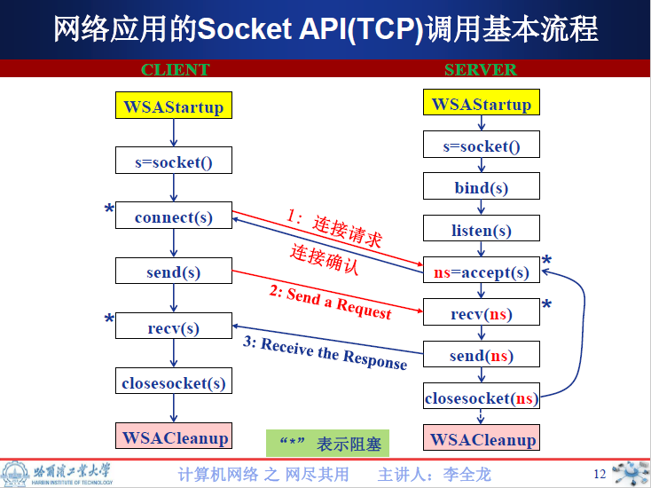

# 文档

- [0. 基础](##0.-基础)
- [1. 函数和结构](##1.-函数和结构)
- [2. 流程](##2.-流程)

## 0. 基础

参考: https://docs.microsoft.com/en-us/windows/win32/winsock/creating-a-basic-winsock-application

---

需要包含的两个头文件

* The `Winsock2.h` header file contains most of the Winsock functions, structures, and definitions. The `Winsock2.h` header file internally includes core elements from the `Windows.h` header file, so there is no need for to include `Windows.h` in Winsock applications
* The `Ws2tcpip.h` header file contains definitions introduced in the WinSock 2 Protocol-Specific Annex document for TCP/IP that includes newer functions and structures used to retrieve IP addresses.

---
需要引入`Ws2_32.lib`链接库

使用`#pragma comment(lib, "Ws2_32.lib")`

> 关于`pragma`的更多用法, 参考: https://docs.microsoft.com/en-us/cpp/preprocessor/comment-c-cpp?view=vs-2019

---

## 1. 函数和结构

### `int WSAStartup(WORD wVersionRequired, LPWSADATA lpWSAData);`

参考:https://docs.microsoft.com/en-us/windows/win32/api/winsock/nf-winsock-wsastartup

用来启动一个windows socket程序. 

用法: 

```C
WSADATA wsaData;

// Initialize Winsock
int iResult = WSAStartup(MAKEWORD(2,2), &wsaData);
if (iResult != 0) {
    printf("WSAStartup failed: %d\n", iResult);
    return 1;
}
```

`WSADATA`存储了windows运行socks程序需要的信息. 

### `int WSACleanup();`

程序结束后用来清理, 释放socket资源.

### `sockaddr`

IPv4下结构:

```C
struct sockaddr {
        ushort  sa_family;
        char    sa_data[14];
};
```

原理是根据`sa_family`采用对应的解释方法解释`sa_data`, 所以直接读`sa_data`是没有意义的, 需要结合具体函数使用. 而sockaddr的生成也应该使用对应的函数生成. 

可以参考: https://stackoverflow.com/questions/32624847/what-is-the-purpose-of-the-sa-data-field-in-a-sockaddr

### `getaddrinfo`

原型是`int getaddrinfo(const char *nodename, const char *servname, const struct addrinfo *hints, struct addrinfo **res);`

`getaddrinfo`是一个封装程度很高的函数, 封装了完整的host和服务地址转换的功能. 并且把结果放到一个`sockaddr`里. 因为创建socket需要用到这个`sockaddr`的结构, 所以创建socket的时候往往先通过`getaddrinfo`得到这个`sockaddr`结构. 

几种用法:

- 查询webserver的IPv4地址:

```C++
struct addrinfo hints, * infoptr;
char host[256];

ZeroMemory(&hints, sizeof(hints));
hints.ai_family = AF_INET;

getaddrinfo("www.baidu.com", NULL, &hints, &infoptr);
// same usage
// getaddrinfo("www.baidu.com", "80", &hints, &infoptr);
// getaddrinfo("www.baidu.com", "http", &hints, &infoptr);

for (auto p = infoptr; p != nullptr; p = p->ai_next) {
    getnameinfo(p->ai_addr, p->ai_addrlen, host, sizeof(host), NULL, 0, NI_NUMERICHOST);
    puts(host);
}
```

- 另外, 如果用在server上, 那么flag应设置为`AI_PASSIVE`, 这样IP地址就会使用`INADDR_ANY`(IPv4)或者 `in6addr_any`(IPv6). 用在server上, 设定`AI_PASSIVE`的flag后, 那么就无需给出第一个参数`nodename`. 因为接下来`bind`的时候, 会自动绑定当前地址. 对于我们的代理服务器来讲, 这里也可以写"127.0.0.1", 即本地地址. 

```C++
struct addrinfo protoStat;
struct addrinfo* result;
int i;

ZeroMemory(&protoStat, sizeof(protoStat));

protoStat.ai_family = AF_INET;
protoStat.ai_socktype = SOCK_STREAM;
protoStat.ai_protocol = IPPROTO_TCP;

// 表明后续使用INADDR_ANY
protoStat.ai_flags = AI_PASSIVE;

i = getaddrinfo(NULL, "8888", &protoStat, &result);
// same usage
// i = getaddrinfo("127.0.0.1", "8888", &protoStat, &result);

```


### `int gethostname(char *name, size_t len);`

获取当前主机的名字:

```C++
char hostname[128];
gethostname(hostname, sizeof(hostname));
printf("%s\n", hostname);
```

在我的本机上输出"JF"

### `gethostbyname(), gethostbyaddr()`

不建议使用的函数, 建议使用`getaddrinfo`和`getnameinfo`替代. 

### `getnameinfo()`

原型是`int getnameinfo(const struct sockaddr *sa, socklen_t salen, char *host, size_t hostlen, char *serv, size_t servlen, int flags);`

给定`sockaddr`查找对应的主机名字和服务名字. 这个函数几乎就是`getaddrinfo`的反面. 

- 参考Beej的指导: https://beej.us/guide/bgnet/html//index.html#getnameinfoman
- 微软的官方文档: https://docs.microsoft.com/en-us/windows/win32/api/ws2tcpip/nf-ws2tcpip-getnameinfo

### `getpeername()`

原型为`int getpeername(int s, struct sockaddr *addr, socklen_t *len);`, 用来返回远程链接的信息. 

一旦使用`accept`接受一个远程连接后, 那么远程连接的对象就成为了一个peer. `getpeername`可以返回远程peer的信息. 在proxy这里就是IP和端口信息. 

## 2. 流程



1. Server端创建socket: https://docs.microsoft.com/en-us/windows/win32/winsock/creating-a-socket-for-the-server
2. socket绑定地址和端口: bind的功能就是把当前通信的地址和socket绑定, 这样client通过这个地址进行通信, 就可以连接到当前server的socket上. https://docs.microsoft.com/en-us/windows/win32/winsock/binding-a-socket
3. 监听socket: https://docs.microsoft.com/en-us/windows/win32/winsock/listening-on-a-socket
4. server端接收socket连接: https://docs.microsoft.com/en-us/windows/win32/winsock/accepting-a-connection
5. 